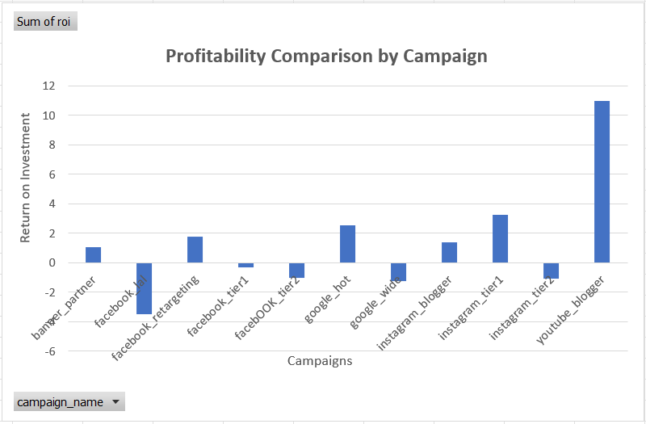
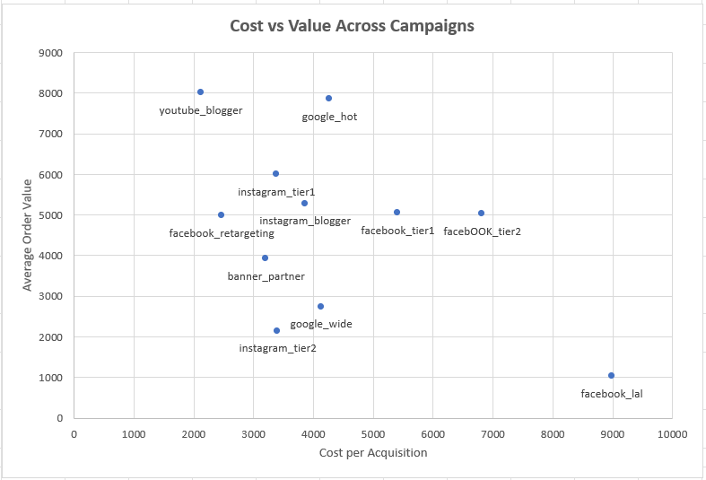
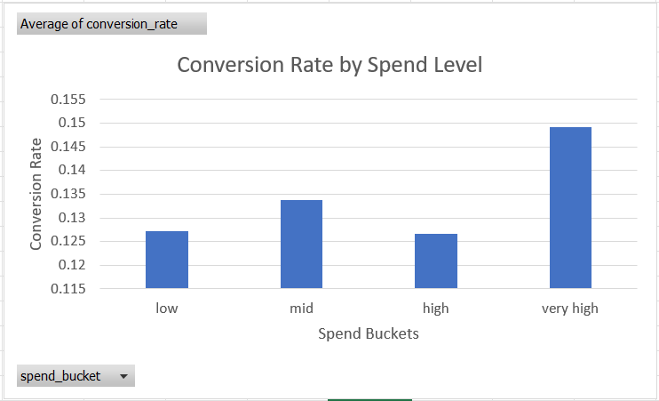

# Marketing Performance Analysis

SQL and Excel-based analysis of marketing campaign performance to examine how scale, profitability, conversion behavior, and customer value interact across different campaign types.

The analysis focuses on:
- Campaign profitability
- Cost vs customer value
- Conversion performance across spend levels
- Performance differences between campaign categories
- Scale effects on campaign interpretation

The project explores how campaign performance changes when metrics such as spend, conversion rate, acquisition cost, and order value are evaluated together rather than independently.

---

## Dataset

Dataset Source:  
[Kaggle - Marketing Dataset](https://www.kaggle.com/datasets/sinderpreet/analyze-the-marketing-spending)

---

## Tools

- SQL
- MySQL
- Excel

---

## Analysis Areas

- Campaign profitability analysis
- ROI comparison across campaigns
- Cost per acquisition vs order value
- Conversion rate by spend level
- Funnel-oriented campaign performance evaluation
- Scale and efficiency analysis

---

## Key Findings

- High-spend campaigns were not always the most profitable.
- Campaign scale significantly affected how performance metrics should be interpreted.
- Some campaigns showed strong conversion efficiency despite lower overall scale.
- Cost per acquisition and customer value varied substantially across campaign types.
- Profitability depended on balancing spend, conversion, and customer value together rather than optimizing a single metric.

---

## Visual Outputs

### Profitability Comparison by Campaign



---

### Cost vs Value Across Campaigns



---

### Conversion Rate by Spend Level



---

## Conclusion

The analysis showed that campaign performance changed significantly depending on whether the focus was on scale, profitability, conversion efficiency, or customer value.

Some campaigns generated higher overall revenue because of scale, while others performed more efficiently relative to their spending and acquisition cost. Looking at individual metrics alone often gave an incomplete picture of overall campaign performance.

Overall, the analysis suggested that marketing performance is better understood by evaluating scale, cost, conversion behavior, and profitability together rather than treating them as separate indicators.

---

## Project Structure

```text
marketing-analysis/
│
├── sql/
│   └── marketing_analysis.sql
│
├── excel/
│   └── marketing_analysis_visuals.xlsx
│
├── images/
│   ├── profitability-comparison.png
│   ├── cost-vs-value.png
│   └── conversion-by-spend.png
│
├── README.md
└── .gitignore
```

---

## Running the Analysis

1. Download the dataset from Kaggle
2. Import the dataset into MySQL
3. Run the SQL queries from:

```sql
sql/marketing_analysis.sql
```

4. Open the Excel workbook to view the visual analysis outputs
